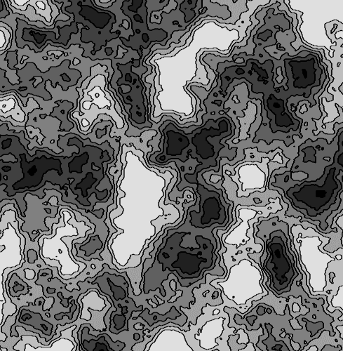
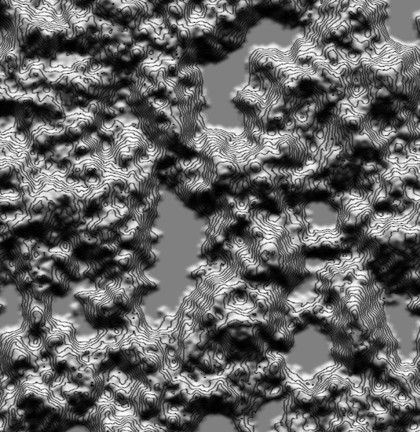

# Cellular Automatown

  

#### Authors:
 [Leon](https://github.com/leon196) ------  [darkbeanbbq](https://github.com/darkbeanbbq) ------   [Lejeunw](https://github.com/lejeunw)

## Description
Cellular Automatown is a project which was born for a game jam about the bio design and the city. It currently lets you toy with its mechanics and do one click terraforming to influence the environment (which is generated by algorithm).

## Download  
https://leon.itch.io/automatown

<!-- #### Downloads -->
<!-- [Windows (GameJam public alpha build)](https://cdn.discordapp.com/attachments/148910712981422080/195678544993583105/Automatown.rar) =>  [[Virus Total Scan]](https://www.virustotal.com/fr/file/3fd82066b3a246896e36fbbf8bc4d9ea4698b352bfb1cbe70c9ce60f16b22261/analysis/1466723574/) -->

## About the code sources
You can check the code sources, but it is a mess (at least the terrain part). It was made in a hurry for a game jam, and we did not clean the code yet.

## Agent algorithms
#### Cities:
This visual shows a small city forming by algorithm

and a big city by a similar type of means.

")

#### Flora:
This algorithm focuses on the propagation on the flora by simple means,

")

once it has comfortably spread out and that units start to perish, the algorithm invests in maintaining it's population and not only spreading out, this is why you can see it stagnating to a certain size

## Environment algorithms

Terrain evolves with pseudo erosion rules.  
You can paint the terrain by clicking first on an altitude and then by dragging to paint it.

### Flat style

### Height map style

### Height map with color style

The water help the growth of ground and fertile zone.  
The sun angle has an impact on the fertile zone.

### Current style (will probably change)

The green zone are fertile ground, where the agents like to spawn. The sun is turning to the environment is in constant change.

### To be continued...
